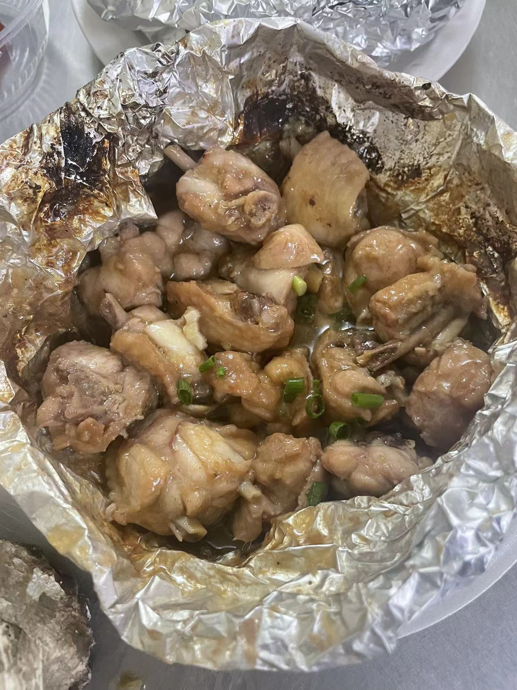
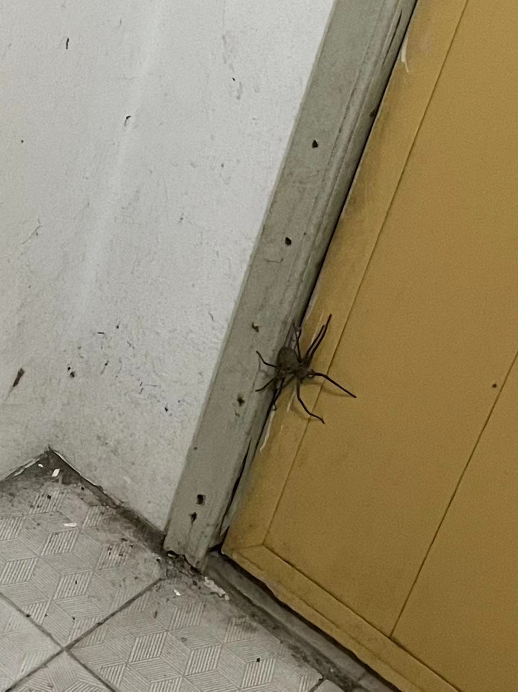
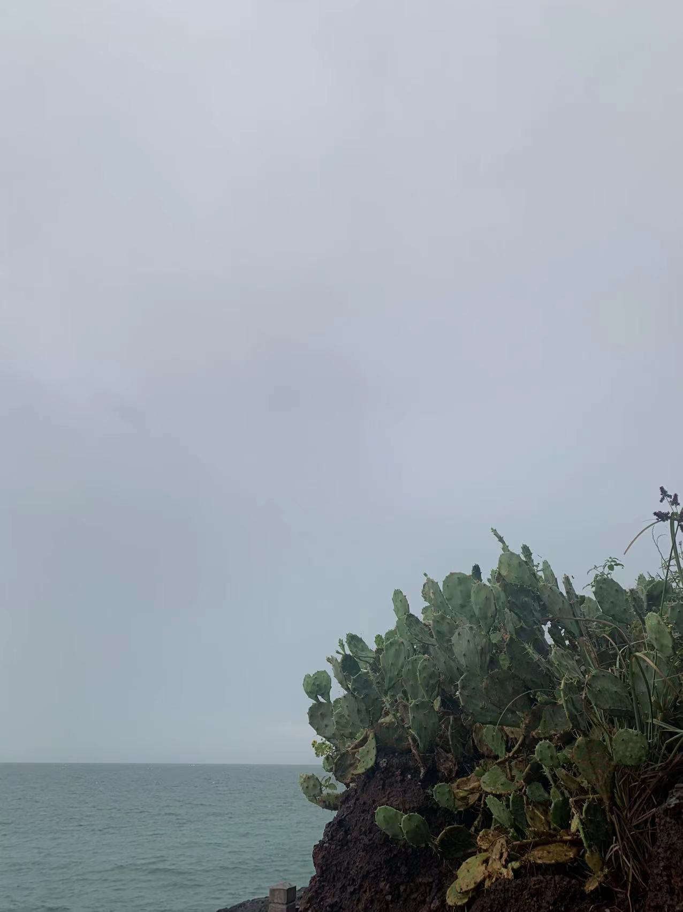
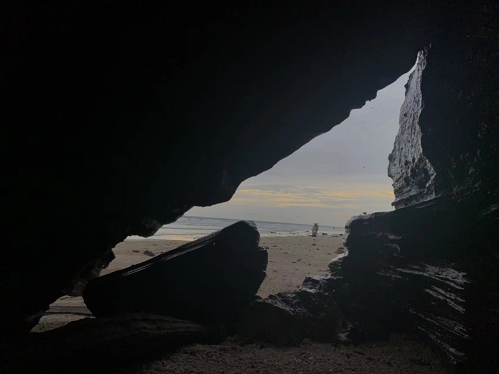
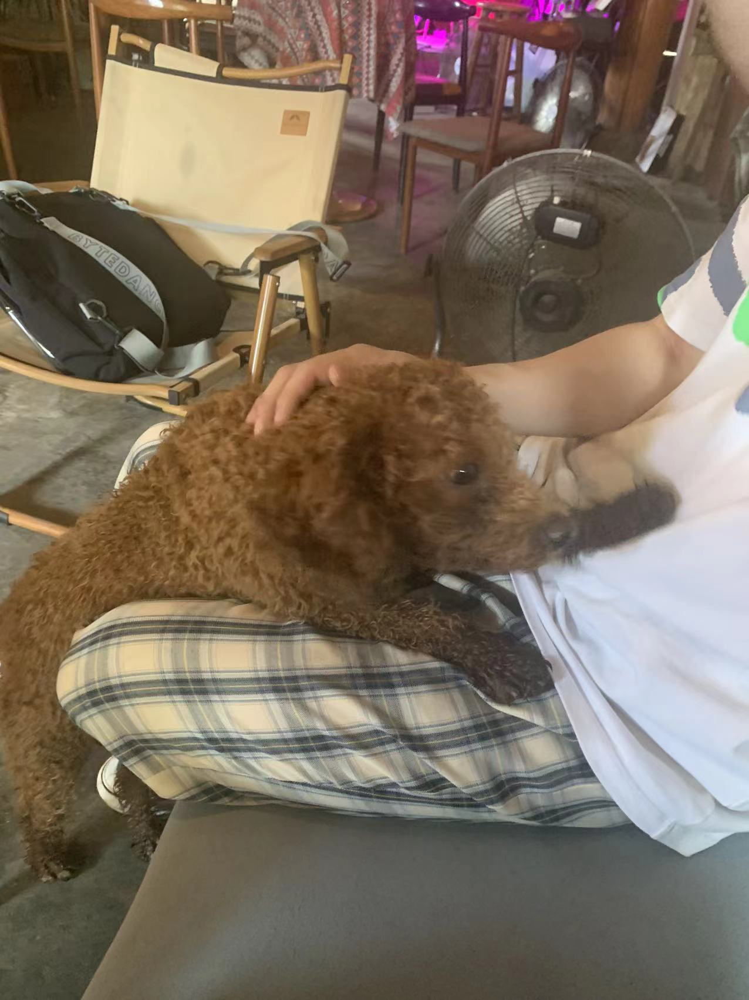

# 北海之旅

## 引言

北海一直是很想去的地方～ 经过了大大小小的计划和无常，我们最后终于决定一起出发去北海！

在这个过程中 用各种**精彩瞬间** 和*vlog* 方式记录我们的**一路之旅** 

在北海涠洲岛度过的时光是我今年迄今为止以来 最悠闲开心的时间 也是我最不后悔的一次旅行✈️ 

在这里发生的所有事情 我会以图文的方式尽可能记录下来 并保存到我的博客服务器中

在以后的任何时间 任何地点 都能回忆这段时间发生的点滴

## 07/04 累热

今天是和伊涵出发的第一天 出发前的vlog

### 路途中

<video width="100%" height="640px" controls preload="none">
	<source src="../images/artical-image/1656918997861566.mp4"></source>
</video>

出发前

路遇 路过桂林的时候 景色真的很宜人 

<video controls preload="none"  width="100%" height="640px">
<source src="../images/artical-image/1656928196461768.mp4"></source>
</video>

路遇 美丽的夕阳

### 到北海啦

晚上9点才下高铁 一下就感觉非常热 然后我们发现北海高铁站居然没有电梯！ 拖着行李箱从长长的坡上走下去的时候  心里都是绝望的..

令人绝望的长坡..

在酒店放完行李后，我们就跑到了**桥港风情街** 吃晚饭～ 下了车已经晚上11点了，但是街上人特别多，店也开的特别多，非常热闹，我们找了家特别有名的店*有间冰室*吃饭，随意点了一些菜：

### 侨港风情街

美食

味道比想象中要好吃，价格也比较便宜，炒冰真的很不错！唯一的缺点就是太热了🔥，晚上11点多我们才吃饭，但是也热到不行，吃一口都能流一脸汗。店内没有空调，环境也比较差，人很多又坐的很挤，吃起来真的又热又闷的难受😣（炒冰的作用体现出来了🧊）

吃完之后去了附近的美食街逛了逛～ 随处可见的大logo和亮牌 

美食街傻拍

吃完我们就回去了，回去的路上在银滩边的马路上逛了逛，吹了吹海风，vlog奉上

### vlog

<video preload="none" controls  width="100%" height="640px">
	<source src="../images/artical-image/1656957436279528.mp4"></source>
</video>

## 07/05 北海老街 观海台 红树林 银滩

### 早晨

早上9点半才醒来.. 完美的错过了日出😄 

不过早上拉开窗帘能直接看到银滩的海 心情还是不错 天气也很放晴 天空特蓝 今天很适合出游

早晨

### 北海老街

起床收拾后 我们直接去了著名的北海老街🚗

进老街！

天气很热 老街又很长（比想象中要长很多很多 走可以走半小时） 但是沿路有很多好看的建筑和奇奇怪怪的小巷子：

老街瞬间

在一家甜品店吃东西的时候 由于吃的太快 又特冰🧊 导致我肠胃出现不适 于是想要上个厕所 问老板娘借了点纸便跑到卫生间，哪知道刚关上门便看到了它..

巨大惊吓

超级大的蜘蛛🕷️ 顿时给我惊的脑袋爆炸💥 也不敢继续上厕所 抓准机会打开门就溜了～（后面跑到公厕去上了 谢谢好心老板娘送了我们两包纸）

在巷子里上厕所的途中 遇见了一个特别的小可爱：

🐱

它特端庄👀 而且眼神很犀利 直勾勾的望着你 大哥也不让摸 不然就挠你 不过喵一声它就会跑出来看你 我跟他玩了将近五分钟 不得不说在北海🐱真的随处可见 而且都不怕人 

和猫猫玩

### 观海台

从老街出来后 我们就去了观海台 海边风很大 空无一人

观海台

直接就奔着去了最近的咖啡店 咖啡店意外的很不错：

### 咖啡静下心

店内风格很好看～

☕️店

奇奇怪怪：

奇奇怪怪

### 红树林

从咖啡店休息后 就去了红树林🌲🌲 红树林的风景很超预期 在海边 风景超美～ 随手一拍都是宫崎骏

红树林

车上凌乱的我们..

<video preload="none" controls  width="100%" height="640px">
	<source  src="../images/artical-image/1657088051050222.mp4"></source>
</video>

风真的很大..

海泉：

海泉倒影

发呆星人：

发呆

油画：

<video preload="none" controls  width="100%" height="640px">
<source  src="../images/artical-image/1657016700041245.mp4"></source>
</video>

沿途美景

### vlog

<video preload="none" controls  width="100%" height="640px">
	<source src="../images/artical-image/1657016734353345.mp4"></source>
</video>

### 银滩

晚上7点半来到银滩看日落 天气不太好 想象中的大片粉色没有出现 加上人超级超级多 整个海岸线几乎被占满

幸运的是海风很大 吹的很舒服

蓝蓝的世界 

～ 海浪🌊的声音很好听

## 07/06 登陆涠洲岛 鳄鱼火山 滴水丹屏 春夏悬崖花园

### 上岛！

早上7点半起床🥱 马不停蹄去赶轮船🚢

由于起太早 所以在船上就是整个就是 睡睡睡😪的状态 船上并没有想象中那么跌宕 不得不说挺适合睡觉

在船上隐隐约约看见的火炬.. 

窗户视角

### 鳄鱼🐊火山

不幸的是上岛后就开始下大雨🌧️ 所以我们熬到了3点半才出门（雨还是没停） 骑电动车的计划泡汤了 于是坐车来到了著名的鳄鱼火山公园（叫公园真的很不准确..）

整个景区步行要走120分钟🏃‍♀️🏃 而且大部分都是山路⛰️ 走起来比想象中要累很多（去之前以为公园是很平的） 走下去后就见到了大海和情人桥 一瞬间劳累一扫而空

到山脚啦

山脚靠海很凉快 加上天气本来就不湿热 所以我们走的还算舒服

下面是一些旅照分享～

海枯石烂

世界的尽头

火山岩

游客照～

海边的仙人掌

### 滴水丹屏

从鳄鱼山离开后 下一站来到了滴水丹屏（名字都取的怪好听） 其实到了后发现是一片海滩 天气比较好 没下雨也不湿热 人也还算多 我们沿着沙滩一直逛到了尽头👫

天空好近好大

<video preload="none" controls  width="100%" height="640px">
<source src="../images/artical-image/1657121876921708.mp4"></source>
</video>

可能这就是所谓的“滴水丹屏”

夹缝中

波涛汹涌

可爱的石子们

<video preload="none" controls  width="100%" height="640px">
<source  src="../images/artical-image/1657120429059727.mp4"></source>
</video>

vlog

### 春夏悬崖花园

逛完滴水丹屏后 我们去春夏花园吃晚饭🥣 店开在悬崖边 抬头就能看到美丽的天空和夕阳 花花草草也超级多

被花草和夕阳围绕起来的店

走近

食物也很好吃 两个人完全吃不完（也可能我们两个食量太小吧） 属于味道和环境和服务都很难挑出毛病

晚饭🥣

夕阳三重奏

落日余晖下

奇奇怪怪视角+2

## 07/07 天主教堂 私奔咖啡馆 小林米粉 相思湖 五彩滩 贝壳沙滩 南湾街

今天起床下了点小雨 

然后我们两又躺到了12点才从酒店出发

第一步是去吃涠洲岛上最著名、评价最高的餐馆： 小林米粉

出发前看到的五只🐦

### 小林米粉

小林米粉主打食物是粉和面

yihan吃了一碗柳州螺狮粉（微微辣  我点了一碗海鲜炒面（里面有虾和鱿鱼

味道确实都很不错～ 价格也很亲民 不愧是岛上最火的一家

这里我们没有拍照片 不过分量确实多

### 天主教堂

第一站来到了天主教堂（天主教堂有个很坑的地方 他不让你骑电车进去 必须要你搭观光车 一次20 但实际上电动车是完全可以开进去的 我们都中招了..

天主教堂外观

内在

古老的教堂走廊

喷泉⛲️

### 私奔咖啡馆

天气太热了 我们逛完教堂热到不行

于是决定去喝点东西

闲逛之余看到一家“私奔咖啡馆” 觉得挺有意思 当即就进去了

进去就看到一只名叫“六一”的金毛狗狗🐶

“六一”

在咖啡馆边享受咖啡边和狗狗互动

后面又来了一只特别活跃的贵宾犬

见人就扑

把我的白衣服踩满了脏脚印👣👣..

特活跃的狗狗 与六一形成鲜明对比

### 五彩滩

第二站来到了五彩滩

为什么是五彩滩 据说是因为沙岩石会在阳光的照射下出现很多种不同的颜色得来的

但是我们也没看出来..

不过景色还是很美的 有特别多布满青苔的石头 又滑又绿 水清澈的能当镜子用

五彩滩边

### 贝壳沙滩

避雷景点来了

贝壳沙滩是我们在五彩滩之后去的

说是贝壳沙滩 但我们真的一个贝壳也没有找到（毫不夸张

本身海滩相比于其他的也稍许逊色 没有什么特点

所以我们就草草逛了一下 就走了 也没有拍照

### 相思湖

逛完两个海滩

下一站是一个网红景点：相思湖水库

直接上图

相思湖

湖很大 水面特别静 站近点观看还挺震撼的

这边人比较少 我们在桥上看的 留下游客照：

湖边

### 南湾街

晚上我们去了南湾街吃饭 下起了下雨 所以我们没走太远

很多饭店都挤满了人 我们走了一会 最后决定去一家名为**“小酒吧烧烤”** 的烧烤店

这部分没有照片

烧烤味道不错 依稀记得小龙虾特别好吃（我是剥🦐高手

其中还有个小插曲 就是我们刚吃完店里直接停电了 然后我在厕所懵了很久..

## 07/08 石螺口海滩 野生景点 潜水

早上我们一觉直接睡到11点 

然后起床发现天气超级好 阳光☀️

直接透过岛上的树荫照射下来

是个出行的好日子（但我忘记涂防嗮霜了.. 直接导致我手臂脖子被烤熟）

出发前

吃饭后 租了个小电驴🛵 我们就出发了 淋着阳光在岛上自由穿行 肆意感受海风在身上吹拂 

### 石螺口海滩

第一个景点是石螺口海滩

石螺口海滩上全是类似珊瑚的小石子 走起来很容易陷进去 有点类似于走在海绵上 所以每一步都走的很累 加上当天太阳很毒 温度很高 在走了不到5分钟后 我已经开始汗如雨下 再不到一会就几乎把刚换的衣服湿完了

走了20分钟 到了打卡景点 速速拍照：

石螺口景点打卡（忽视我的衣领颜色

打卡完我们就赶紧跑了 实在太热🔥 海滩还是不适合中午的时间点去逛

### 野生景点记

下一个景点我们参照小红书的“藏宝地图” 根据指示来到了一个没有地图的地方

途中路过了一片大草地🌲🌲 风景很美 留念一下

大草地

经过大草地后 我们骑车经过了一个小泥坑.. 然后我们恰恰好好的栽进去了 导致我们两的鞋子全部变成了泥土联名（还有我的裤子和腿

泥土限定

反正经历了种种磨难 我们最后还是到达了想象中的地点 路途艰辛 结果美好

时间是金

### 潜水

在岛上的最后一站 我们去潜水🤿啦 之前一直对潜水有股向往 对海底世界有很多期待

潜水比想象中要更加需要勇气和技巧 海里的世界也比想象中要更加生动

打个招呼

<video preload="none" controls  width="100%" height="640px">
<source src="../images/artical-image/1657351324882926.mp4"></source>
</video>

手忙脚乱的两人

### 离岛

在岛上度过了三天两夜后 我们踏上了回去的步伐

总的来说 涠洲岛是一个特别适合旅游的地方 我们也仍然有许多地方没有逛 许多店没有吃 许多事情没做

潜完水后 我们乘着船离开了涠洲岛 

归夕

## 07/09 回家啦

今天是在北海的最后一天啦

下午就要坐高铁回家了 默默想了这五天的经历 开心的时间真的过得很快 回忆起来也是很清晰

北海带给我的整体体验挺好的 也经历了很多开心的事情

以后有机会再来～

