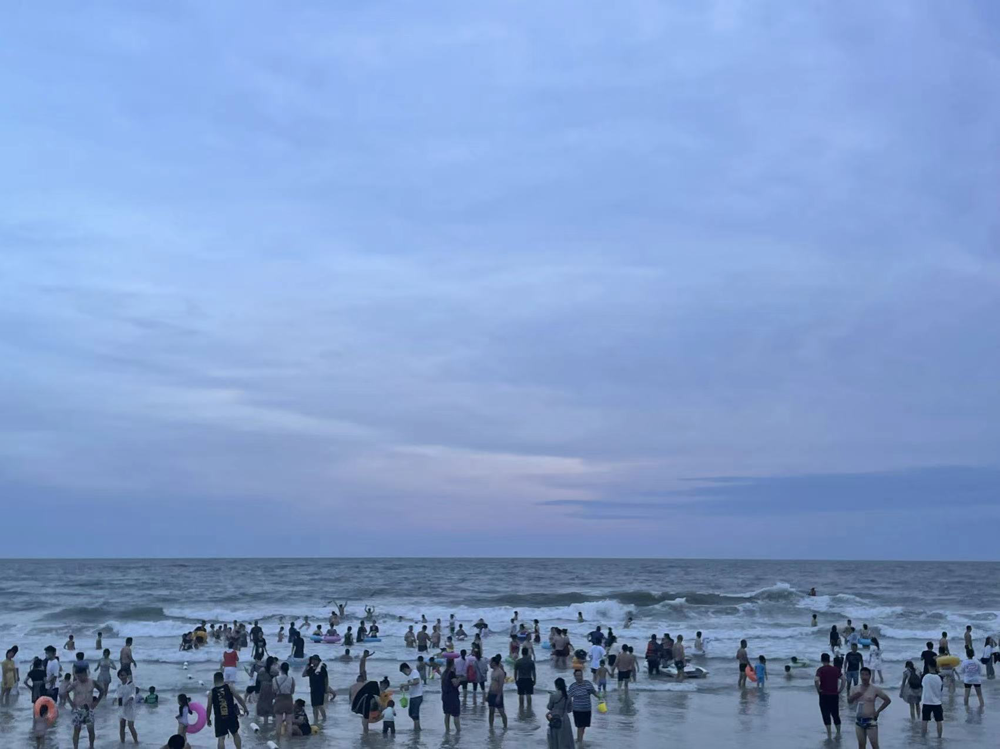

# 北海之旅

## 引言

北海一直是很想去的地方～ 经过了大大小小的计划和无常，我们最后终于决定一起出发去北海！

 在这个过程中 用各种**精彩瞬间** 和*vlog* 方式记录我们的**一路之旅** 

## 07/04 累热

今天是和伊涵出发的第一天 出发前的vlog

### 路途中

<video src="../images/artical-image/1656918997861566.mp4" width="100%" height="640px"></video>

出发前

路遇 路过桂林的时候 景色真的很宜人 

<video src="../images/artical-image/1656928196461768.mp4"></video>

路遇 美丽的夕阳

### 到北海啦

晚上9点才下高铁 一下就感觉非常热 然后我们发现北海高铁站居然没有电梯！ 拖着行李箱从长长的坡上走下去的时候  心里都是绝望的..

令人绝望的长坡..

在酒店放完行李后，我们就跑到了**桥港风情街** 吃晚饭～ 下了车已经晚上11点了，但是街上人特别多，店也开的特别多，非常热闹，我们找了家特别有名的店*有间冰室*吃饭，随意点了一些菜：

### 侨港风情街

美食

味道比想象中要好吃，价格也比较便宜，炒冰真的很不错！唯一的缺点就是太热了🔥，晚上11点多我们才吃饭，但是也热到不行，吃一口都能流一脸汗。店内没有空调，环境也比较差，人很多又坐的很挤，吃起来真的又热又闷的难受😣（炒冰的作用体现出来了🧊）

吃完之后去了附近的美食街逛了逛～ 随处可见的大logo和亮牌 

美食街傻拍

吃完我们就回去了，回去的路上在银滩边的马路上逛了逛，吹了吹海风，vlog奉上

### vlog

<video src="../images/artical-image/1656957436279528.mp4"></video>

## 07/05 北海老街 观海台 红树林 银滩

### 早晨

早上9点半才醒来.. 完美的错过了日出😄 

不过早上拉开窗帘能直接看到银滩的海 心情还是不错 天气也很放晴 天空特蓝 今天很适合出游

早晨

### 北海老街

起床收拾后 我们直接去了著名的北海老街🚗

进老街！

天气很热 老街又很长（比想象中要长很多很多 走可以走半小时） 但是沿路有很多好看的建筑和奇奇怪怪的小巷子：

老街瞬间

在一家甜品店吃东西的时候 由于吃的太快 又特冰🧊 导致我肠胃出现不适 于是想要上个厕所 问老板娘借了点纸便跑到卫生间，哪知道刚关上门便看到了它..

巨大惊吓

超级大的蜘蛛🕷️ 顿时给我惊的脑袋爆炸💥 也不敢继续上厕所 抓准机会打开门就溜了～（后面跑到公厕去上了 谢谢好心老板娘送了我们两包纸）

在巷子里上厕所的途中 遇见了一个特别的小可爱：

🐱

它特端庄👀 而且眼神很犀利 直勾勾的望着你 大哥也不让摸 不然就挠你 不过喵一声它就会跑出来看你 我跟他玩了将近五分钟 不得不说在北海🐱真的随处可见 而且都不怕人 

和猫猫玩

### 观海台

从老街出来后 我们就去了观海台 海边风很大 空无一人

观海台

直接就奔着去了最近的咖啡店 咖啡店意外的很不错：

### 咖啡静下心

店内风格很好看～

☕️店

奇奇怪怪：

奇奇怪怪

### 红树林

从咖啡店休息后 就去了红树林🌲🌲 红树林的风景很超预期 在海边 风景超美～ 随手一拍都是宫崎骏

红树林

车上凌乱的我们..

<video src="../images/artical-image/1657088051050222.mp4"></video>

风真的很大..

海泉：

海泉倒影

发呆星人：

发呆

油画：

<video src="../images/artical-image/1657016700041245.mp4"></video>

沿途美景

### vlog

<video src="../images/artical-image/1657016734353345.mp4"></video>

### 银滩

晚上7点半来到银滩看日落 天气不太好 想象中的大片粉色没有出现 加上人超级超级多 整个海岸线几乎被占满

幸运的是海风很大 吹的很舒服

蓝蓝的世界 

～ 海浪🌊的声音很好听

## 07/06 涠洲岛

### 上岛！

早上7点半起床🥱 马不停蹄去赶轮船🚢

由于起太早 所以在船上就是整个就是 睡睡睡😪的状态 船上并没有想象中那么跌宕 不得不说挺适合睡觉

在船上隐隐约约看见的火炬.. 

窗户视角

