# 苏州之旅

## 引言

万众期待的国庆终于到来～

本次🐱🐱和🐶🐶计划到苏州去旅游，blog记录点点滴滴

## 苏州

### 10/02

下高铁后我们直奔酒店，苏州今天的天气比想象中要热很多，夏天似乎不舍得早早离去，穿着短衣物的我们在路上仍然出了不少汗水，虽然已经10月，但回到酒店第一件事便是开空调。

#### 山塘街

收拾完后已经临近傍晚了，按照计划我们踏进了山塘街，准备进行夜游。山塘街和白居易颇有渊源，白居易任苏州刺史时，对苏州城外西北河道进行疏浚，开挖成山塘河，傍河而建的古街被称为山塘街。沿街均为古建筑：

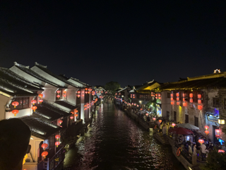

山塘街夜景

由于没有核算记录进不去山塘街（下了高铁做了，过了三个多小时仍然没记录，苏康码比我们想象中效率要低很多），于是我们首先在外面闲逛了一会，吃了一碗热乎乎的芝麻糊：

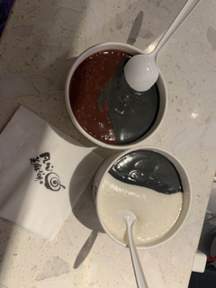

芝麻糊～～

从山塘街进入后，第一感觉是，人多，人巨多，两边鳞次栉比的房屋，中间的道路区域被一个个的人填满，偶尔传来莫名的香味和不知名的吆喝声，一切一切都证明，我们在不合时宜的时候来对了地方：

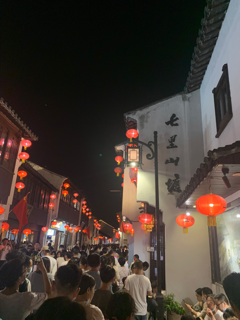

拥挤的山塘街

我们两个都不喜爱这只热闹、拥挤的景象，于是我们脱离了人群，来到河边闲走，晚上的灯火配上平静的山塘河，偶尔的小船划过，这很容易让浮躁的心渐渐静下来：

平静的山塘河

值得一提的是，山塘河旁边其实有两条大相径庭的“山塘街”，一条是特别繁华的、充满了商业化的“繁华山塘”，也就是我们刚刚走过的、需要扫核算码、熙熙攘攘、充满了人群与香味的地方。另外，在以一条桥的分界处往南，其实有另外一种风格的山塘街，充满了烟火气、安静、有老苏州人一年四季的衣食住行的“烟火山塘”：

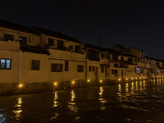

烟火山塘

“烟火山塘”更得我们的喜好，我们在里面肆意的闲逛，吃了碗地道的苏州面，沿着小巷深处一直走，直到成为黑夜中唯二的两个存在：

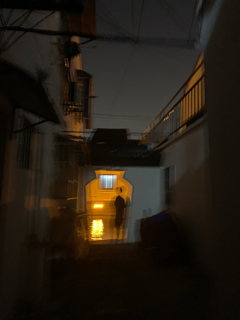

小巷

一条街，两种气质，繁华与烟火共存，这是否也侧面反映了苏州的一种特有文化，即要与时俱进，也要安于现状

### 10/03

天气晴，温度达到30+，适合出门

#### 观前街

观前街其实类似于步行街，名字的由来是街的位置坐落在一个“道观”前，游玩的整体感受和步行街没什么区别，花了30分钟匆匆走过，没有留下太多印象

观前街～

#### 平江路

平江路是一条历史老街，整条街所呈现的景象也是唐宋以来的街坊格局，堪称古城缩影。

但其实对于历史并不感冒的我们来说，对平江路的来由与历史故事并提不起什么兴致。完全是出于对它的地方特色和美食而来。

大名鼎鼎的平江路其实是一条水巷，除了拥挤之外基本找不出什么缺点。平江路是一条有着悠久历史的老街，倚着平江河，植被茂盛，河流平静，我们在这里逗留了很长时间，几乎整条街都被我们走了个三四遍，无论是白天还是晚上，平江路的景色和风味都不尽相同。除了拥挤吵闹之外，很难再找出平江路的缺点。

平江路的美食也很有特色，平江路一条街从头到尾两边都是美食，吆喝声络绎不绝，并且基本上在街上开的小店都是与苏州的特色饮食密切相关的，像桂花糕（超好吃，我们买了两次）、👇这个糕，都是比较好吃的美食，吃着苏州特色的小吃，一起逛着苏州特有的水巷～

糕糕

苏州

#### 沧浪亭

沧浪亭是苏州众多园林之一，也是我们去的第一个园林，相比于拙政园、狮子林等园林，它并没有什么很大的名气，所以前来的游客也并不是很多，但是这反倒如我们的愿，我们都是爱静的人，走在沧浪亭里，能偶尔享受到难得的二人世界，搭配上沧浪亭静谧、自然的景色，是很难得的体验

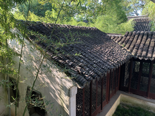

沧浪亭内

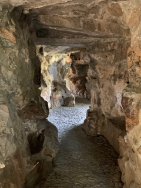

园内的假山

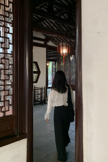

“阶梯式”的内屋

外廊

印心石屋

石屋内的🐱🐱

#### 十全街

享受完沧浪亭后，我们有点疲乏，准备吃点喝点东西，打开地图一看，附近几百米就有个十全街，便起身前往。十全街上有很多大大小小的咖啡店（超级多）和各种小吃店，是个适合逛街的地方，听说这里有一家特别好吃的苏式绿豆汤，对于特别喜爱绿豆汤的我，听到这个消息后就立马拉上🐱🐱前往，不带任何停留，几分钟就到了小红书上爆火的阿婆绿豆汤

但是这个绿豆汤的味道.... 实在是一言难尽，可能是我们两个不喜欢这种口味。我特地点了两杯“纯绿豆汤”，但是“纯绿豆汤”里也加了各种杂七杂八的东西，绿豆特别硬，没有煮烂，加上各种莫名的甜味，我和小🐱一人喝了大概一两口，就直接落荒而逃

从此对“苏式绿豆汤”这几个字有了阴影，我实在没想到绿豆汤能做出这种味道

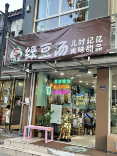

苏式绿豆汤

🐶🐶无语的在喝绿豆汤

随便喝了两口绿豆汤，我们马不停蹄的赶往咖啡馆，幸好咖啡馆的味道相当不错，风格布局也很受🐱🐱喜爱，我们边喝咖啡边发呆，一待就是一个多小时

麻雀咖啡馆

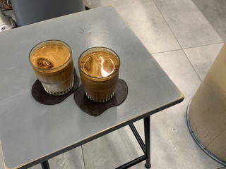

两杯好喝的dirty

#### 纳口

从十全街出来后，我们走往了双塔夜市，步行两公里后，我们到夜市的时候是晚上8点半，但是这个时候夜市居然关门了？？

哪有晚上8点就关门的夜市！！ 无语的同时 又感到有点习惯 和🐱🐱出来遇到不寻常事情的概率 似乎一直不低 所以我很快就转换了心态 去往了来路上看到的一家名叫“纳口”的店

这家店老板特别热情 店虽然很小但有自己的风格 最重要的是相当好吃 所以把它也记载在我的博客中 位置就在双塔市集旁边的巷子里 走两步就能看见～

凉皮

超好吃的米粉

### 10/04

今天起床天气转凉了，可以穿上预备的保暖衣服，到了这个季节气温转变非常快，所以旅游得多备几套夏装和秋装

#### 还没想好名字的咖啡酒馆

第一站是一家很特别的咖啡馆，它“还没想好名字”，位置很深，在一家小巷子里，印象很深的是他的桂花拿铁，咖啡配上桂花的香甜，特别赞

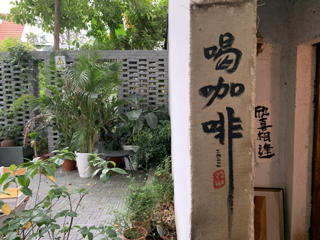

咖啡馆的小院

咖啡～

内景

偷看的小猫

#### 狮子林

狮子林是今天的重头戏，它最大的特点就是假山特别多，分布在园区各个地方，在假山周围有水池萦绕，四周有精美的庭院

狮子林一角

假山地段

假山合影

#### 吃桂花糕

苏州的桂花糕绝对称得上是一个特色美食，软糯的糕点配上里面各式的夹心，我们连着两天买了两盒吃，每次都吃完，搭配上咖啡的味道更绝

### 10/05

对于猫猫来说，咖啡是难得的精神粮食，所幸苏州的咖啡店非常多，有特色的也不少

#### 羍（da）市

羍（da）市是一家坐落在平江路旁边的咖啡馆，来苏州已经见过很多家有特色且好喝的咖啡馆了，这家也不例外，而且这家自带猫咪可以随便撸～～

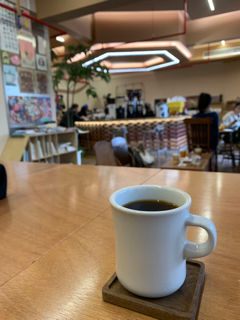

咖啡馆内

咖啡馆内的猫猫

#### 耦园

本来耦园并不在我们的计划之内，但由于我经常把耦园读成“丑园”，念着念着便想着去看看它到底啥样，刚好藕园离我们很近，顺路就过去了，藕园也是一个比较小众的园林，但是它给我们带来了很多惊喜

藕园的特色窗户

藕园的🐶🐶

长廊

角落

角落

狗狗在藕园

### 10/06

心心念念的西园寺，心心念念的原因是西园寺是一所以猫著名的园林，里面最大的特色就是猫，随处可见的猫猫，随便撸的猫猫，各种颜色的猫猫

#### 西园寺

撸猫猫1

撸猫猫2

其中有一只小黑猫特变黏人，追着yihan不放，一直窝着不让走

我们和小黑猫

两只猫

偷摸猫猫

#### 铁手咖啡制造局

全球前50的咖啡馆，那当然得来尝尝，机会难得，只在苏州开一年时间

#### 蟹三宝

苏州著名美食，当然要有蟹黄饭/面的名号，这家店排队排了2小时，但是味道确实很棒，店不大却很暖，无论是饭还是面，搭配上金黄的蟹黄豆特别香

蟹黄鸡煲

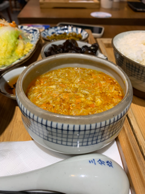

蟹黄饭

