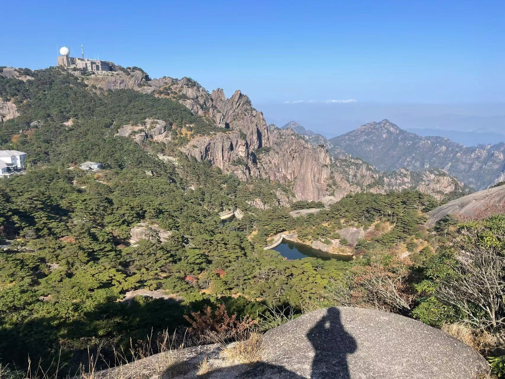
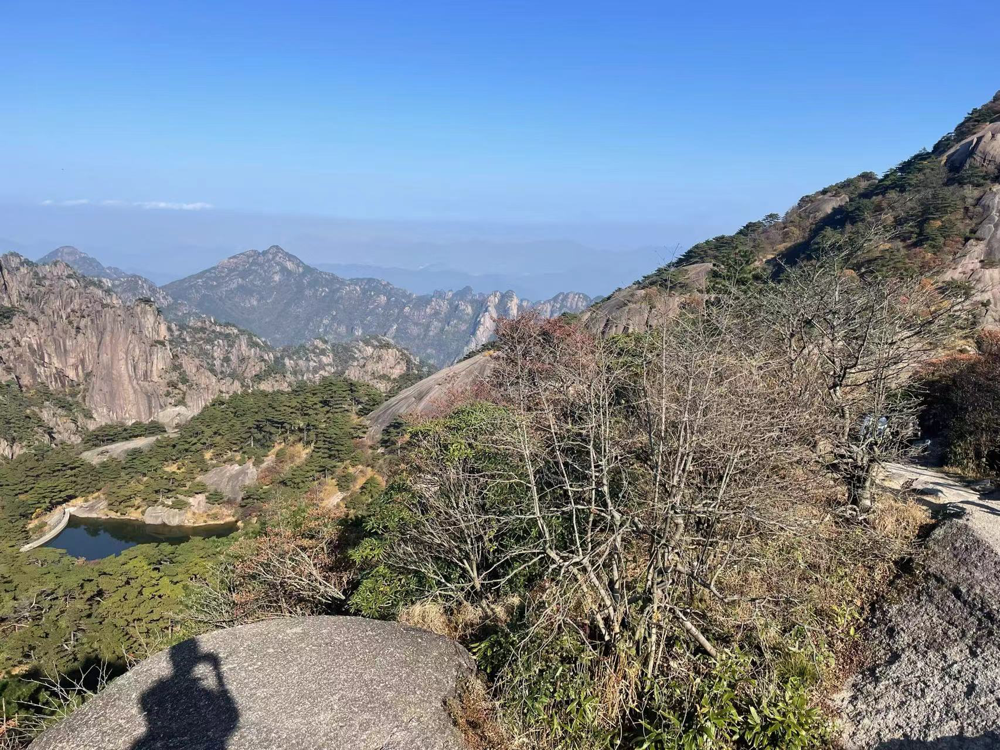
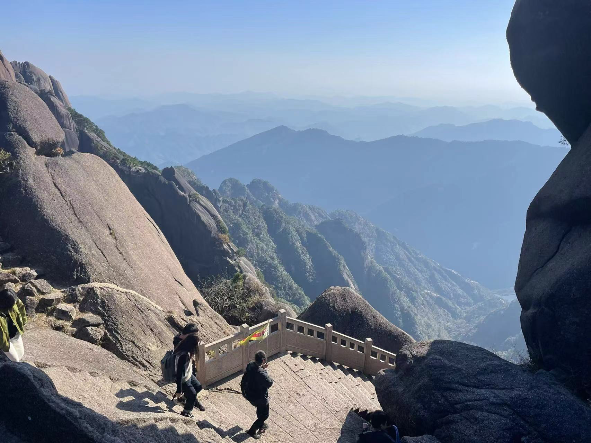
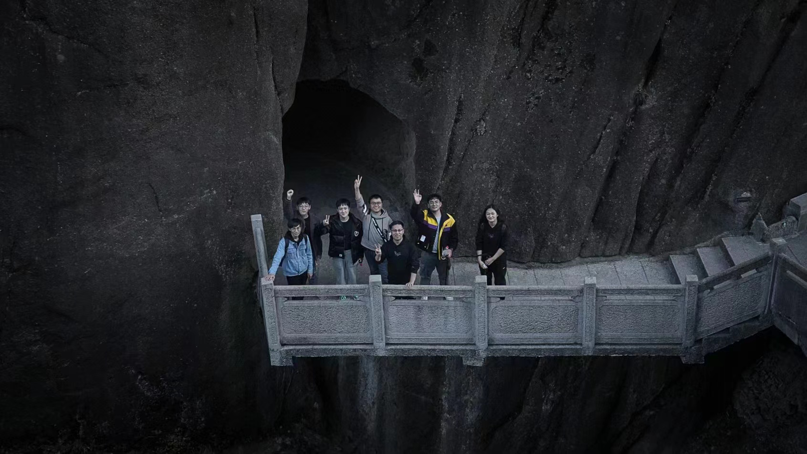
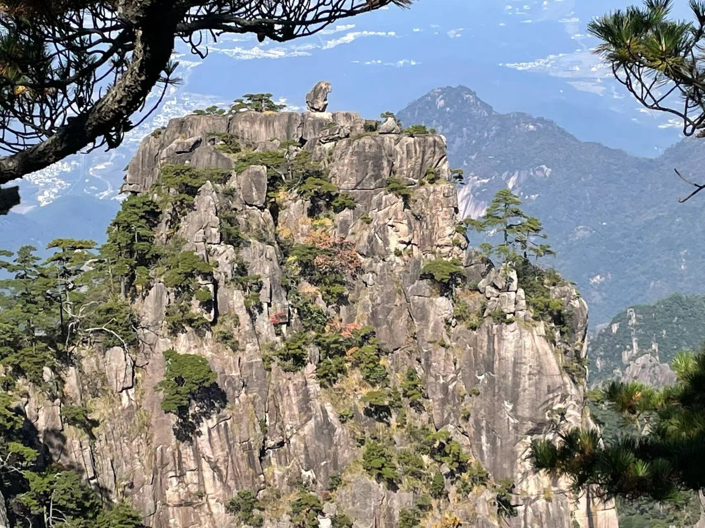

## 引言

今年10月底，还在实习的我和公司内的大家一起去了安徽黄山进行团建～

## 瞬间

## 感受

黄山比我想象的还要高很多，超级难爬

我是缆车上去缆车下来（本来想爬上去的，到山底下我畏惧了= =）也一共爬了7小时左右，并且山顶温度很低，需要备好防寒措施

山上著名景点很多，例如光明顶（和金庸小说中的那个无关）、猴子观海、百步云梯、梦笔生花、飞来石、鳌鱼峰、迎客松等等，想全部光顾一遍一天时间也是完全足够的（只要你不怕累）

山脚下有露天温泉，强烈建议爬完山后直接去泡温泉，可以舒缓一天的劳累，温泉体验很好，人也不多，泡完后还能吃点自助餐

