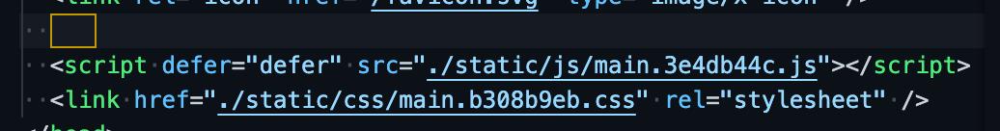

## Nginx安装、常用命令和配置文件

安装：<code>brew install nginx</code>

```shell
nginx -v

nginx

ps -ef | grep nginx

nginx -s stop

nginx -s reload

tail -f /usr/local/var/log/access.log

tail -f /usr/local/var/log/error.log

// 关闭master进程相当于stop
kill -QUIT ${pid} || kill -TERM ${pid}

// after update
nginx -t
nginx -s reload
```


```shell
默认情况：
/usr/local/etc/nginx/nginx.conf
/usr/local/Cellar/nginx
/usr/local/var/log

brew:
/opt/homebrew/etc/nginx/nginx.conf
/opt/homebrew/Cellar/nginx
/opt/homebrew/var/log/nginx/access.log
```


## Nginx配置文件详解

```shell
## first component 影响整体运行的配置指令
include main.conf;
user nobody;
master_process off | on;
worker_processes 1;

error_log logs/error.log

pid logs/nginx.pid;

## second component 影响nginx服务器和用户连接
events {
	accept_mutex: on;
	multi_accept: on;
	worker_connection: 1024;
}

## third componet http

http {
	include mime.type;
	default_type: application/octet-stream;
	
	# log_format ...
	# access_log
	
	sendfile on;
	keepalive_timout 65;
	# gzip on
	
	# 负载均衡 轮询（默认）
	upstream myserver {
			# ip_hash; nginx记住访问的ip，以后这个ip只能访问初次访问的，解决session
      server 127.0.0.1:3000 weight=10;
      server 127.0.0.1:3001 weight=10;
   }
	
	server {
		listen 8080;
		server_name localhost;
		access__log logs/mylog.log # 就近原则
		
		location / {
		  # root 即找到对应的目录，访问根路径就是访问这个目录
			root html;
			index index.html; # 默认情况下 返回root资源目录下的index.html;
			# try_files
			# 当用户请求 http://localhost/example 时，这里的 $uri 就是 /example。

			# try_files 会到硬盘里尝试找这个文件。如果存在名为 /root 是项目代码安装目录）的文件，就直接把这个文件的内容发送给用户。

			# 显然，目录中没有叫 example 的文件。然后就看 root/example/ 的目录。
			# 又找不到，就会 fall back 到 try_files 的最后一个选项 /index.php，发起一个内部 “子请求”，也就是相当于 nginx 发起一个 HTTP 请求到 http://localhost/index.php
			try_files $uri $uri/ /index.php?$query_string;
		}
		
		location /proxy/ {
			# 反向代理
			proxy_pass http://192.167.2.1:3000/;
		}
		
		location /get_text {
			default_type text/html;
			access_log logs/text.log;
			return 200 "this is nginx's text";
		}
		
		# 功能和不包含正则表达式一样，不同点在于匹配到之后就不会继续向下匹配
		location ^~/abc {
			default_type text/plain;
			return 200 "access success";
		}
		
		# 模糊匹配，/abc, /abced
		location /abc {
			default_type text/plain;
			return 200 "access success";
		}
		
		# ~表示包含正则并区分大小写，~*不区分
		location ~/abc {
			default_type text/plain;
			return 200 "access success";
		}
		
		# 精确匹配，但是query是不影响的
		location = /abc {
			default_type text/plain;
			return 200 "access success";
		}
		
		error_page 500 502 503 504 /50x.html;
		location = /50.html {
			root html;
		}
	}
}
```

## 配置SSl

https://cloud.tencent.com/document/product/400/35244


## 平时配置中遇到的问题

### 前端二级路由刷新后出现404

```shell
server {
	listen 80;
	server_name 101.35.46.26;
	location / {
		root /home/yaobojun/site/web-blog/build;
		index index.html;
	}
	
	location /api/ {
		proxy_pass http:127.0.0.1:3000/;
	}
	
	location /images/ {
		root /home/yaobojun/koa-node/dist/source/;
	}
}

....
```

*为什么会出现404* ?

自己思考了一下，在**不刷新** 的情况下，前端路由跳转是没有向<code>server</code>发起<code>document</code>请求的，也就是除了<code>api</code>请求，流量其实没有走到<code>nginx</code>，前端<code>url</code>的变化引起静态资源的改变，然后展示不同页面，这一过程是由前端控制的

在**刷新**后，页面上所展示的所有内容都要去<code>server</code>中获取，包括<code>document</code>，但我们请求的路由是<code>/articles</code>，这一路由虽然在前端有控制，但是<code>nginx</code>中是没有配置的，所有返回了404的状态码

解决： <code>try_files</code>

```shell
location / {
		root /home/yaobojun/site/web-blog/build;
		index index.html;
		try_files $uri $uri/ index.html;
	}
# 这里try_files配置后，当我们访问例如/articles 这样的路由， $uri=/articles
# 他会一层层回溯，如果有/articles或者/articles/的路径，会直接返回，否则会自动发一个请求到 index.html, 然后走到前端的路由控制

```

## 前端homePage配置不正确导致页面空白

```shell
# package.json
{
	# 一开始我是这么配的
	homePage: '.';
	...
}
```



但是随后发现一个问题，一级路由例如<code>/articles</code>刷新后，是能正常显示的，但是二级路由例如<code>/articles/aaa</code>刷新后，页面就空白了

思考了一下，原因应该是这样：

二级路由刷新后，他找静态资源<code>css、js</code>等，用的是相对路径，也就是去一级路由里面找了，这样当然找不到，找不到<code>css、js</code>等文件，页面虽然没有报错，也没有404，但是就显示空白了

解决方法是把<code>homePage: ''</code>设置为根路径，这样静态资源永远从根路径去找，我们的静态目录也是放在根目录下的，如果静态资源没有放在根目录下，而是放在某一个特点的<code>uri</code>里，那么<code>homePage</code>也要设置为特定的<code>uri</code>
