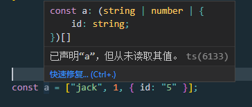
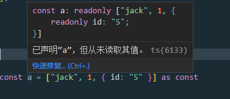

# as const

在项目中遇到了一个问题:


这个函数签名简直莫名奇妙

后来发现加上<code>as const</code>


变得顺眼多了

那<code>as const</code>究竟是啥?

看一个例子:

```react
const a = ["jack", 1, { id: "5" }];
```



a是一个元素为<code>string</code>或者<code>number</code>或者含有id对象的数组，这明显与我们的预期不符，因为我们想要一个元素为string | number | object的数组，主要原因是ts中的数组里面的类型必须一致，所以他会解析成上面那种情况。

如果我们加上<code>as const</code>呢?



a变成了一个数组，里面第一个元素是'jack'，第二个是1，第三个是对象

<code>as const</code>主要用在数组中，在编写ts代码时，灵活运用<code>as const</code>能解决一些有趣的问题。

