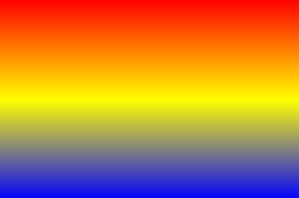
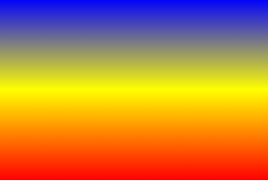
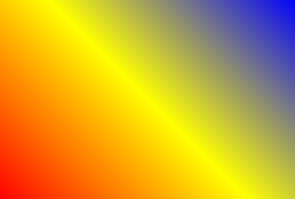
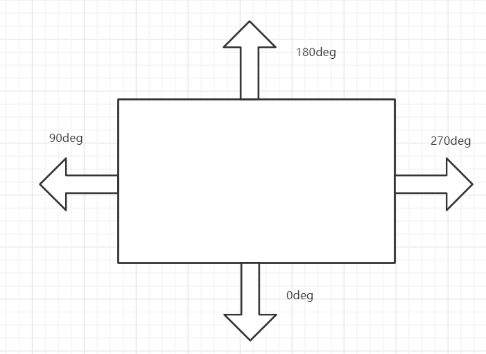
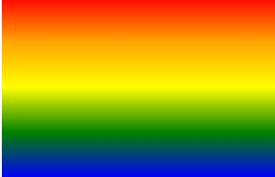
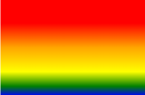
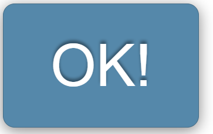
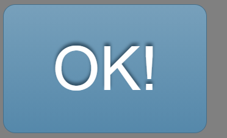
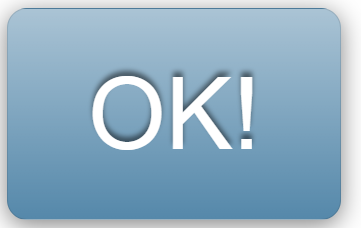

# CSS: linear-gradient的介绍和在实际项目中的使用


## linear-gradient

CSS [<code>linear-gradient </code>](https://developer.mozilla.org/zh-CN/docs/Web/CSS/linear-gradient())函数用于创建一个表示两种或多种颜色线性见表的图片

<code>linear-gradient</code>函数接收三个值: 

<code>&ltside-or-corner&gt</code>

​	描述渐变线的起始点位置。它包含**to**和两个关键词：第一个指出水平位置**left or right**，第二个指出垂直位置**top or bottom**。关键词的先后顺序无影响，且都是可选的。

​	to top, to bottom, to left 和 to right这些值会被转换成角度**0度、180度、270度和90度**。其余值会被转换为一个以向顶部中央方向为起点顺时针旋转的角度。渐变线的结束点与其起点中心对称。

<code>&ltangle&gt</code>

​	用角度值指定渐变的方向（或角度）。角度顺时针增加。 

<code>&ltlinear-color-stop&gt</code>

​	由一个color值组成，并且跟随着一个可选的**终点位置**（可以是一个**百分比值**或者是沿着渐变轴的**length**。CSS渐变的颜色渲染采取了与**SVG相同**的规则。

<code>&ltcolor-hint&gt</code>

​	颜色中转点是一个插值提示，它定义了在相邻颜色之间渐变如何进行。长度定义了在两种颜色之间的哪个点停止渐变颜色应该达到颜色过渡的中点。如果省略，颜色转换的中点是两个颜色停止之间的中点。 

听起来很复杂，看几个例子就明白了

```css
.box {
    width: 300px;
    height: 200px;
    background: linear-gradient(red, yellow, blue);
    /*等价于*/
    /*background: linear-gradient(180deg, red, yellow, blue)*/
    /*background: linear-gradient(to bottom, red, yellow, blue)*/
}
```



可以看到，实现了从<code>red -> yellow -> blue</code>的线性渐变，且渐变角度从上到下，也就是从**180deg到0deg**，即默认情况下，第一个参数等于**180deg**

现在改变一下角度试试:

```css
.box {
    width: 300px;
    height: 200px;
    background: linear-gradient(0deg, red, yellow, blue);
    /*等价于*/
    /*background: linear-gradient(to top, red, yellow, blue)*/
}
```



可以看到，图片完完全全的倒立过来了

```css
.box {
    width: 300px;
    height: 200px;
    background: linear-gradient(45deg, red, yellow, blue)
    /*等价于*/
    /*background: linear-gradient(to right top, red, yellow, blue)*/
}
```


由此可以看出，<code>linear-gradient</code>中图片角度的规律



除此之外，颜色的每个值都可以设置终止位置

```css
.box {
    width: 300px;
    height: 200px;
    background: linear-gradient(red 0%, orange 25%, yellow 50%, green 75%, blue 100%)
}
```



当然也可以使用<code>px</code>

```css
.box {
    width: 300px;
    height: 200px;
    background: linear-gradient(red 50px, orange 100px, yellow 150px, green 180px, blue)
   	/*最后一个默认为终点位置*/
}
```



> 需要注意的是，当你生命了<code>linear-gradient</code>中的颜色属性后，再添加<code>background-color</code>或者向<code>background</code>中添加颜色是无效的，因为linear-gradient的颜色把原来的背景颜色全部覆盖了，但把<code>color</code>值设为<code>tranparent</code>能显示回原来的颜色，也就是你用<code>background-color</code>设置的颜色

那我们怎样在项目中去**合理**的应用这个属性呢?

举个简单的例子，当我们创建一个按钮

```css
button {
        padding: 0.3em 0.8em;
        border: 1px solid #446d88;
        background: #58a;
        border-radius: 0.2em;
        box-shadow: 0 0.05em 0.25em gray;
        color: white;
        text-shadow: 0 -0.05em 0.05em #335166;
        font-size: 1em;
        line-height: 1.5;
      }
```



现在给这个按钮添加换一个渐变背景
```css
button {
        padding: 0.3em 0.8em;
        border: 1px solid #446d88;
        background: linear-gradient(#77a0bb, #58a);
        border-radius: 0.2em;
        box-shadow: 0 0.05em 0.25em gray;
        color: white;
        text-shadow: 0 -0.05em 0.05em #335166;
        font-size: 1em;
        line-height: 1.5;
      }
```


到这里，一个简单的有**质感**的按钮就完成了

但到这里仍存在一些问题，按钮是在项目中经常重复用到的部分，假如现在我们要创建一个红色按钮或者黄色按钮，该怎么办呢?

我们可能需要覆盖四条属性，<code>border-color</code>，<code>text-shadow</code>，<code>box-shadow</code>，<code>background</code>，因为颜色变了后这些属性都要跟着改变，而且，确定一个颜色的**渐变**效果需要知道这个颜色的**亮色**和**暗色**版本(例如上面的按钮就需要知道<code>#58a</code>和<code>#77a0bb</code>)，并且如果按钮放在一个**非纯白色背景**上呢，例如放到<code>gray</code>背景里



此时<code>box-shadow: gray</code>属性明显就不能体现出来该有的效果

那有没有方法能一次性解决上面的问题又更加简洁呢，<code>linear-gradient</code>可以派上用场了，用<code>linear-gradient</code>设置一个**半透明的白色**作为主色调就能解决这个难题

```css
button {
        padding: 0.3em 0.8em;
        border: 1px solid rgba(0,0,0,.1);
        background:   #58a linear-gradient(hsla(0, 0%, 100%, .5), transparent);;
        border-radius: 0.2em;
        box-shadow: 0 0.05em 0.25em rgba(0,0,0,.5);
        color: white;
        text-shadow: 0 -.05em .05em rgba(0,0,0,.5);
        font-size: 1em;
        line-height: 1.5;
      }
```




现在，我们只需要改变<code>background-color</code>就能得到不同颜色的**渐变按钮**

```css
button {
        padding: 0.3em 0.8em;
        border: 1px solid rgba(0,0,0,.1);
        background:   #58a linear-gradient(hsla(0, 0%, 100%, .5), transparent);;
        border-radius: 0.2em;
        box-shadow: 0 0.05em 0.25em rgba(0,0,0,.5);
        color: white;
        text-shadow: 0 -.05em .05em rgba(0,0,0,.5);
        font-size: 1em;
        line-height: 1.5;
      }

button.cancel {
    	background-color: red;
	  }
```


这就是<code>linear-gradient</code>在实际项目中的一个小应用，也是我读[Css揭秘](https://www.ituring.com.cn/book/1695)这本书学到的一个有用的知识。


