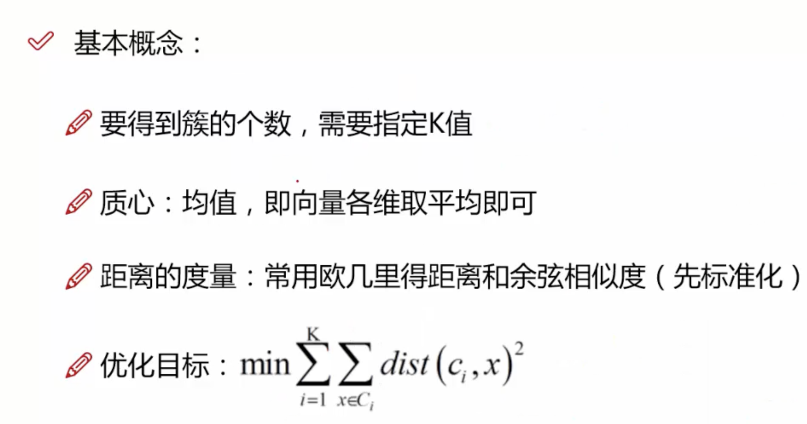

## 什么是用户画像？

- *用户画像* (UserProfile)也叫用户信息标签化、客户信息标签化
- 从平台的角度来看，就是根据你的一些静态属性（例如身高、体重、学历）和一些动态行为（例如购买、收藏、点赞），用一组标签把你的人物给画出来，描述你的标签就是用户画像


## 源数据


## 标签从何来


## 用户画像建模


可行性

重点

难点

方法


### 


```shell

```

## 用户画像如何生成

- 通过数据建立描绘用户的标签

- 用户画像不是标签的简单组合

- 用户画像的标签要和业务相结合

  


### 用户标签维度

- 静态属性标签：长期甚至永久都不会发生改变：性别
- 动态属性标签：存在有效期，需要定期更新：用户活跃度

### 用户画像和特征工程

用户画像的核心是标签，标签的核心是特征工程

特征工程就是将数据转化为特征的过程


### TGI和用户人群


必须要有两个人群的对比才会又TGI


## 特征工程流程


### 1.特征理解


### 2. 特征增强


### 3.特征构建


### 4.特征选择


### 数值型数据的特征提取（身高、体重等）


### 文本型数据的特征提取（句子）


### TF-IDF


## TF-IDF + SVM进行评论的情感提取


## FM算法


## 标签设计


## 标签表


用户行为次数抽取出来


用户标签主题表


## 基于TF-IDF的标签权重算法


## 用户行为权重


### 基于时间衰减因子的用户标签权重


## 朴素贝叶斯算法预测性别

## 标签应用


